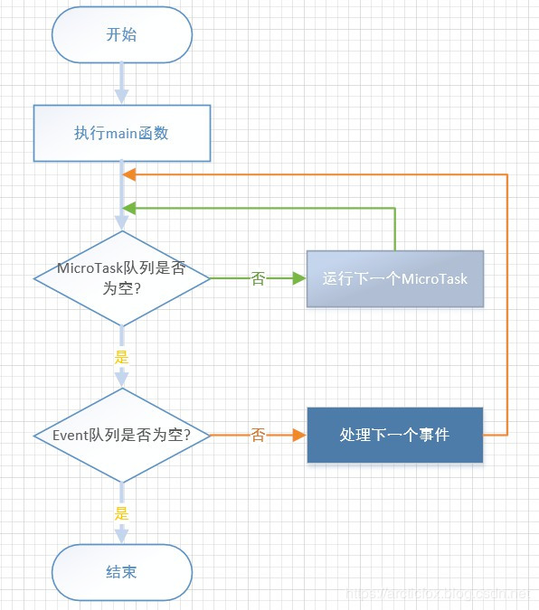

一切皆对象。

指定返回值为 void，这才是真正的没有返回值。

函数没有定义返回值，默认返回null。
```dart
test() {
  
}
```


定义了返回类型，而没有return语句，表示 return null
```
int test() {
  
}
```

Dart 的事件循环.
 - MicroTask queue 微任务队列
 - Event queue 事件队列 (鼠标单击、I/O消息等等事件)


Future  
通常是异步任务。加入Event队列。  
microtask() 会加入到 microtask 队列。  
sync() 会比 microtask 队列中的还要先执行。  

Isolate 创建并发耗时任务。在Flutter中 可以用 compute()来创建。